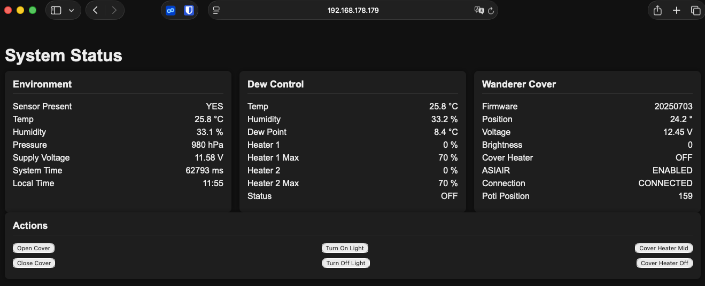
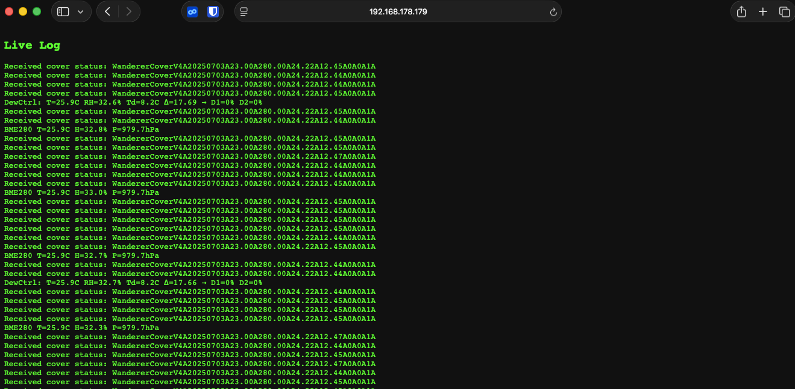

# Starting Setup
I have the following equipment:
* WandererCover V4-EC Professional Flatpanel
* Celestron EdgeHD 800 with 0.7 reducer and Off-Axis-Guide and a Dew Heater
* ASIAir Plus
* ZWO ASI585MC (main) and ZWO ASI220M (Guide)
* ZWO Autofocuser
* ZWO Filter Wheel
* Sky Watcher EQ6-R Pro

So all equipment can be conviniently controlled by the ASIAir Plus, except the Wanderer Cover...
(To be fair: The Cover can be controlled by a series of power on/off cycles via the ASIAir - but this is a more a pain, than a feature)
I have a small Windows Tablet to control it - but this is overkill, just to open/close the cover and adjust the brightness.

So target of this project is to have a small standalone unit to control everything onsite via local controls (e.g. buttons)

---

# Requirements Collection

- Small controller with Wi-Fi capability to host a web interface
- USB host capability to control the WandererCover via USB virtual COM port  
  - Direct USB connection from the control system to the WandererCover
- Power supply via 12V  
  - The WandererCover is powered and switched through the control system
- Two additional separate 12V outputs, PWM-controlled  
  - For external dew heaters
- Ability to measure voltage level at the 12V input port
- Integrated temperature and humidity sensor
- Separate buttons:
  - Open
  - Close
  - Light on with a selected brightness via Poti
  - Light off
- LED feedback:
  - Light on/off status
  - Wi-Fi connection
  - USB communication feedback
- Optional: OLED support for a 0.96" display  
- Wi-Fi networks configurable via settings  
  - The strongest configured network should be used

---

# Key Components

- Wemos LOLIN S3 Pro
- Brightness adjustable via potentiometer
- BME280 climate sensor via I2C
- OLED AZDelivery SSD1306 0.96" display via I2C
- MOSFET IRLZ44N
- Buck converter 1584EN module

---

# The result - Hardware
I created the schematic and PCB in Kicad.  All files stored in subfolder hardware, there you can also find the gerber files.
Since I am not very good at soldering, therefore the design has only big components, no SMD. To keep it simple, I only wanted a single sided PCB, no Vias, no connections on top layer necessary.
There is only one palce, where sections of the ground plane is connected via the switches - but this seems to be the case in all switches of this form factor.

As I have a Carvera Air desktop CNC, I made the PCB by myself - the results are below

and the final assembled version looks like this:

After a short check, nothing seems to burn or explode after applying 12V - I went for the next part: software

A small hint: the buck converter is not fixed to 5V - so I recommend to solder that one first, then apply 12V and adjust the poti on the buck converter to get the desired 5V out of it, only then continue with the rest of the components. Otherwise there is the risk to damage components if they see more than the 5V.

# The result - Software
In case you want to adapt the software, just install Visual Studio Code with the PlatformIO extension. The rest gets downloaded automatically if you open the folder in VS Code.
The Lolin S3 Pro has only one USB port - so after the first flashing of the software you cannot use the USB port anymore for updating or logging of events.
All further updates have to be applied via the OTA method, or by manually bringing the ESP32 in the bootloader mode.

The software itself is pretty straight forward. For PIN, WiFi and I2C control you can use standard libraries.

I implemented a scheduler. It gets the time from the internet and can execute certain tasks at a predefined time. Currently I only use it for auto-closing the cover at a certain time in the morning.

First challenge is the serial communication to the cover: Unfortunately I figured out quite late, the the cover uses a CH341 chip - which does not follow the standard CDC communication. Luckily Bert Melis has developed a library to communicate with this chipset. I installed a retry mechanism: after 5s without proper communication it just re-initializes the communication.

The BME280 and OLED display have standard libraries from Adafruit - I just included them.

The Dew heater control is fully automatic, you can specify a maximum rate (usually 70%), then as soon as the temperature goes towards the dew point, the heaters gradually switch on until max power.
Two dew heaters with 12V specification can be attached, in my case I have one for the optics and one at the mount.

The Webserver is based on the ASyncWebserver libraries - quite simple but effective. 

The main page looks like this and can be accessed by http://(-IP of Cover Control-)/ :

All necessary information is stored there and updated each 2 seconds.

As mentioned before, the logging feature is no longer available via USB due to the communication to the cover, therefore you can access the logged events via the route http://(-IP of Cover Control-)/log

I found it as a pleasant surprise, that the LOLIN S3 Pro has a SD-card reader onboard - so all the configuration is stored in a textfile "config.txt" on the SD-card. The initial version is part of this repository. It can also be updated via Web-Interface - no need to get off the couch ;)

Adress to this page is http://(-IP of Cover Control-)/config

As you can see, you can define some basic behaviour - and also access data to WiFi networks (max 10). It automatically selects the strongest network and connects to this - including retry, in case connection gets lost. The format ist quite simple: `wifi=SSID;password` - each wifi network gets a new line. On this page you can also scan for networks to find the strongest one.

The `ota_password=password` is also quite important - this has to match the entry in the platformIO.ini

All in all the software is still below 1MB Flash - so plenty of headroom for more improvements.

# The result - including housing
OK - for the housing my patience was already quite low - so it does not win any beauty prices...

But it is functional - please note, that the temperature sensor is physically separated from the rest of the electronics, so that any heating of components does not affect (too much) the measurement of the surrounding temperature.

The OLED display was initially only a optional feature, but actually I do most of the adjustments with the information provided there:

# In the end
I have used this device now for several nights - no problem discovered.

You can freely use this project for your needs (as long as it is non commercial). You have all necessary information here:
- KiCad Project files with schematic and PCB layout
- Exported Gerber Files with bottom layer, top silkscreen, edge cuts and drill files
- CNC files for Makera Carvera Air (or compatible)
- 3MF Files for housing - including the source f3D file for Fusion360
- All Software files incuding platformIO.ini to build the executable

Have fun and clear skies!
