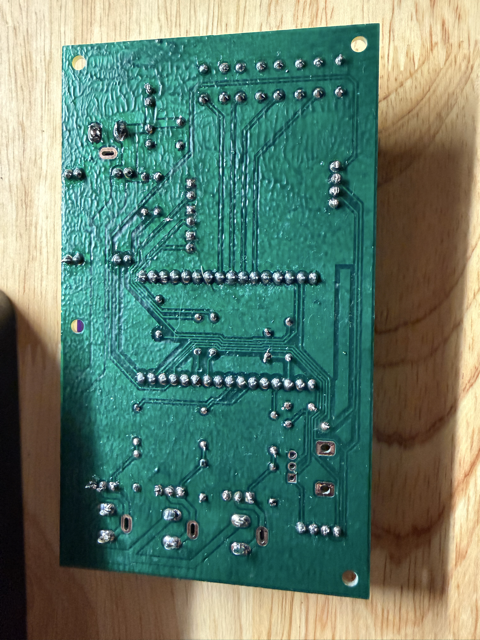
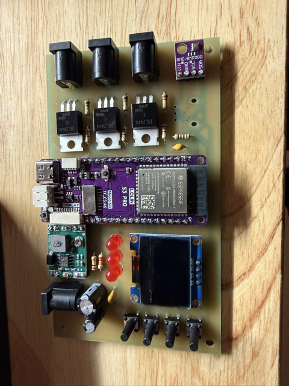
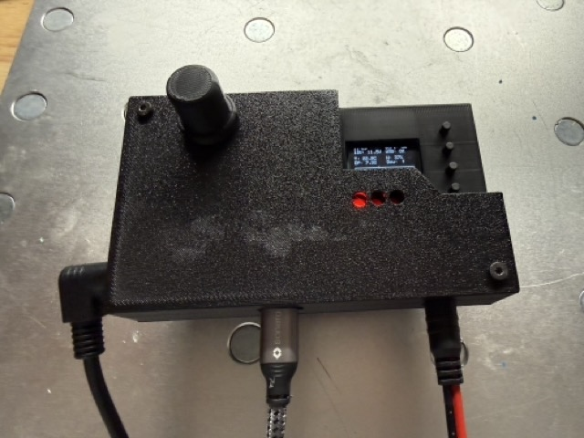
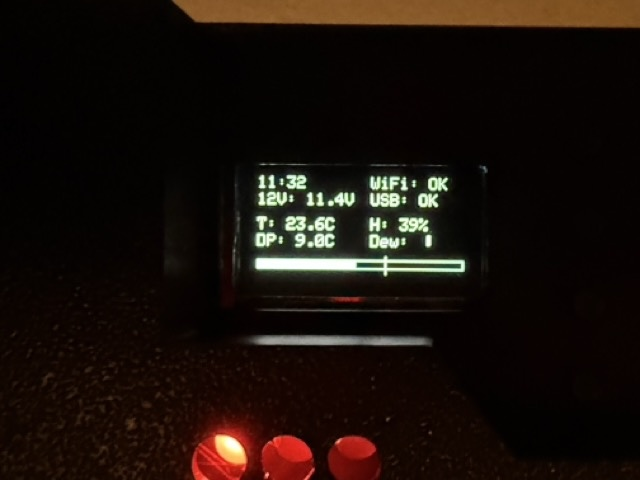

# Starting Setup
I have the following equipment:
* WandererCover V4-EC Professional Flatpanel
* Celestron EdgeHD 800 with 0.7 reducer and Off-Axis-Guide and a Dew Heater
* ASIAir Plus
* ZWO ASI585MC (main) and ZWO ASI220M (Guide)
* ZWO Autofocuser
* ZWO Filter Wheel
* Sky Watcher EQ6-R Pro

So all equipment can be conviniently controlled by the ASIAir Plus, except the Wanderer Cover...
(To be fair: The Cover can be controlled by a series of power on/off cycles via the ASIAir - but this is a more a pain, than a feature)
I have a small Windows Tablet to control it - but this is overkill, just to open/close the cover and adjust the brightness.

So target of this project is to have a small standalone unit to control everything onsite via local controls (e.g. buttons)

---

# Requirements Collection

- Small controller with Wi-Fi capability to host a web interface
- USB host capability to control the WandererCover via USB virtual COM port  
  - Direct USB connection from the control system to the WandererCover
- Power supply via 12V  
  - The WandererCover is powered and switched through the control system
- Two additional separate 12V outputs, PWM-controlled  
  - For external dew heaters
- Ability to measure voltage level at the 12V input port
- Integrated temperature and humidity sensor
- Separate buttons:
  - Open
  - Close
  - Light on with a selected brightness via Poti
  - Light off
- LED feedback:
  - Light on/off status
  - Wi-Fi connection
  - USB communication feedback
- Optional: OLED support for a 0.96" display  
- Wi-Fi networks configurable via settings  
  - The strongest configured network should be used

---

# Key Components

- Wemos LOLIN S3 Pro
- Brightness adjustable via potentiometer
- BME280 climate sensor via I2C
- OLED AZDelivery SSD1306 0.96" display via I2C
- MOSFET IRLZ44N
- Buck converter 1584EN module

---

# The result - Hardware
I created the schematic and PCB in Kicad.  All files stored in subfolder hardware, there you can also find the gerber files.
Since I am not very good at soldering, therefore the design has only big components, no SMD. To keep it simple, I only wanted a single sided PCB, no Vias, no connections on top layer necessary.
There is only one palce, where sections of the ground plane is connected via the switches - but this seems to be the case in all switches of this form factor.
As I have a Carvera Air desktop CNC, I made the PCB by myself - the results are below

and the final assembled version looks like this:

After a short check, nothing seems to burn or explode after applying 12V - I went for the next part: software
A small hint: the buck converter is not fixed to 5V - so I recommend to solder that one first, then apply 12V and adjust the poti on the buck converter to get the desired 5V out of it, only then continue with the rest of the components. Otherwise there is the risk to damage components if they see more than the 5V.

# The result - Software
In case you want to adapt the software, just install Visual Studio Code with the PlatformIO extension. The rest gets downloaded automatically if you open the folder in VS Code.
The Lolin S3 Pro has only one USB port - so after the first flashing of the software you cannot use the USB port anymore for updating or logging of events.
All further updates have to be applied via the OTA method, or by manually bringing the ESP32 in the bootloader mode.

# The result - including housing
OK - for the housing my patience was already quite low - so it does not win any beauty prices...
But it is functional - please note, that the tempreature sensor is separated from the rest of the electronics, so that any heating of components does not affect (too much) the measurement of the surrounding temperature.

The OLED display was initially only a optional feature, but actually I do most of the adjustments with the information provided there:

